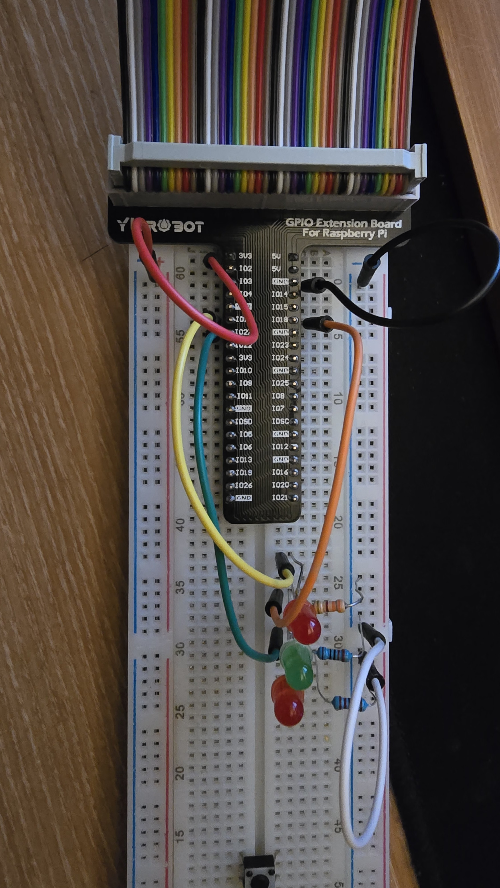

# 3-Bit Binary Counter (counter8)

이 프로젝트는 3개의 LED를 사용하여 0부터 7까지 이진수로 표현하는 카운터를 구현합니다.

## 하드웨어 구성 요소

- 라즈베리 파이 5
- 3개의 LED
- 3개의 저항 (330Ω 권장)
- 점퍼 와이어
- 브레드보드

## 핀맵

- LED 0 : GPIO 27 -> 보드의 핀 13
- LED 1 : GPIO 18 -> 보드의 핀 12
- LED 2 : GPIO 17 -> 보드의 핀 11

## 회로 구성



각 LED는 다음과 같이 연결됩니다:
- LED의 양극(긴 다리)을 해당 GPIO 핀에 연결
- LED의 음극(짧은 다리)을 330Ω 저항을 통해 GND(접지)에 연결

## 코드 설명

이 스크립트는 `pinctrl` 명령을 사용하여 GPIO 핀을 제어합니다:

1. LED 핀을 출력 모드로 설정하고 초기 상태를 LOW로 설정합니다.
2. `display_binary` 함수는 숫자를 이진수로 변환하여 LED로 표시합니다.
3. 무한 루프에서 0부터 7까지 카운트하며 각 숫자를 이진수로 표시합니다.
4. 각 숫자가 1초 동안 표시됩니다.

## 이진수 표현

- 0: 모든 LED 꺼짐 (000)
- 1: LED 3 켜짐 (001)
- 2: LED 2 켜짐 (010)
- 3: LED 2, 3 켜짐 (011)
- 4: LED 1 켜짐 (100)
- 5: LED 1, 3 켜짐 (101)
- 6: LED 1, 2 켜짐 (110)
- 7: 모든 LED 켜짐 (111)

## 사용 방법

1. 회로를 위의 핀 매핑대로 구성합니다.
2. 스크립트 파일을 실행 가능하게 만듭니다:
```bash
chmod +x counter8.sh
```
3. 스크립트를 실행합니다:
```bash
./counter8.sh
```
4. 종료하려면 `Ctrl+C`를 누릅니다.

## 동작 영상


## 구현 세부 사항

이 프로젝트는 3개의 LED를 사용하여 0부터 7까지의 숫자를 이진수로 표현합니다. 카운터는 0부터 시작하여 1초마다 증가하며, 7에 도달한 후 다시 0부터 시작합니다. 이진수 표현에서 MSB(Most Significant Bit)는 GPIO 27에, LSB(Least Significant Bit)는 GPIO 17에 연결되어 있습니다.