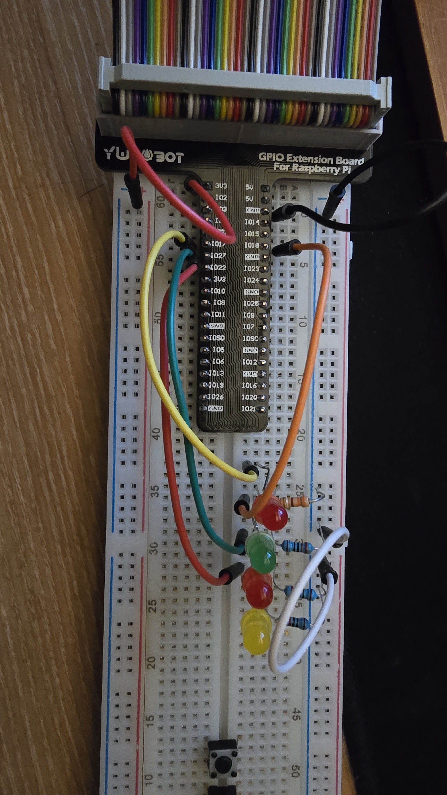

# LED Domino Project (domino4)

이 프로젝트는 4개의 LED를 순차적으로 켜고 끄는 도미노 효과를 구현합니다.

## 하드웨어 구성 요소

- 라즈베리 파이 5
- 4개의 LED
- 4개의 저항 (330Ω 권장)
- 점퍼 와이어
- 브레드보드

## 핀맵

- LED 0 : GPIO 17 -> 보드의 핀 11
- LED 1 : GPIO 18 -> 보드의 핀 12
- LED 2 : GPIO 27 -> 보드의 핀 13
- LED 3 : GPIO 22 -> 보드의의 핀 15

## 회로 구성



각 LED는 다음과 같이 연결됩니다:
- LED의 양극(긴 다리)을 해당 GPIO 핀에 연결
- LED의 음극(짧은 다리)을 330Ω 저항을 통해 GND(접지)에 연결

## 코드 설명

이 스크립트는 `pinctrl` 명령을 사용하여 GPIO 핀을 제어합니다:

1. LED 핀을 출력 모드로 설정하고 초기 상태를 LOW로 설정합니다.
2. 무한 루프에서 각 LED를 순차적으로 켜고 1초 후에 끕니다.
3. 각 LED가 깜빡인 후 다음 LED로 이동합니다.

## 사용 방법

1. 회로를 위의 핀 매핑대로 구성합니다.
2. 스크립트 파일을 실행 가능하게 만듭니다:
```bash
chmod +x domino4.sh
```
3. 스크립트를 실행합니다:
```bash
./domino4.sh
```
4. 종료하려면 `Ctrl+C`를 누릅니다.

## 동작 영상

[](https://www.youtube.com/watch?v=ZagnGnomUuo)

## 구현 세부 사항

LED들은 순차적으로 켜지고 꺼지며, 도미노가 넘어가는 것처럼 한 번에 하나의 LED만 켜집니다. 각 LED는 1초 동안 켜진 후 꺼지고 다음 LED가 켜집니다. 이런 방식으로 LED가 순환합니다.